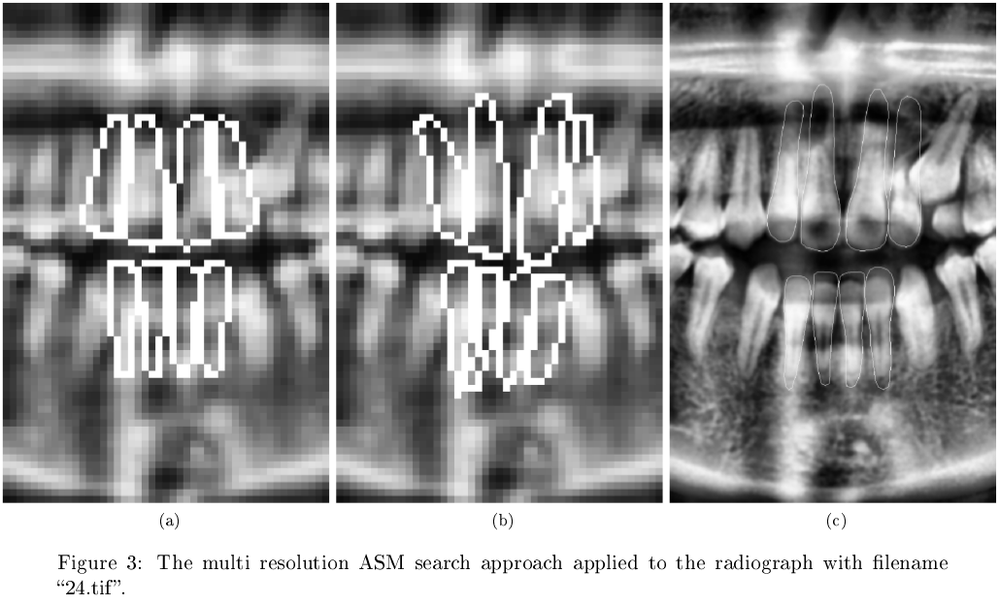

# Computer Vision: Incisor Segmentation
_Project for the [Computer Vision](https://onderwijsaanbod.kuleuven.be/syllabi/e/H02A5AE.htm) course at KU Leuven._

This repository presents two approaches towards automatic detection of incisor teeth in dental radiographs. The first approach is based on active shape models for individual teeth. The other approach uses one active shape model for all teeth and fits the model to images using a multi-resolution search algorithm. The [report](report/report.pdf) provides an introduction to active shape modeling and explains both approaches in more detail. It also discusses the performance that was achieved with each model.

GUI applications have been created for each of the two approaches, so each one of them can be tested interactively. The scripts for these GUIs can be found under src/scripts. They are named 'gui_initalization_model_search.py' for the first approach, and 'gui_multi_resolution_search.py' for the second one.
To run each of these scripts, simply run the following command:

    python3 script_name.py

### User guide for 'gui_initalization_model_search'
When opening the GUI the user can see three things:
1. The current image.
2. A slider to select the image the user wants
3. A slider to select the tooth model the user wants to fit. 0 indicating the first tooth and 7 indicating the last tooth.

If a user wants to try to fit a model himself/herself, all he/she needs to do is click on the image at the desired location. This will draw an initial landmark at that position. To iteratively improve this landmark, press the 'n' key until the desired result is achieved. If the placement of the landmark was wrong, just click on another location and restart the process.

If the user is interested to see the initial placement model at work (as described in the paper) the user can press the key 'i'. This will automatically place the initialization model at the correct location. To improve this model the user can press 'n' until the desired result. Then the user can use this converged model as initial placement by clicking on their desired position in this model. This will draw the model for an individual tooth at that location. The user can then press 'n' to converge this model.

To automatically segment a tooth, press 'a' and wait until the process is done. This will automatically place the initialization model, make it converge, and initialize an individual tooth model on the correct location in the converged initialization model.

### User guide for 'gui_multi_resolution_search'
When opening this GUI, the user will see a low resolution image of a radiograph. Different resolution levels can be chosen using the slider below. At any resolution level, a model can be initialized by clicking on the image. The model can then be improved iteratively using by pressing 'n'. This will cause the model to be fit to the image iteratively until convergence. If the resolution level is changed then a model is present on an image, the model will be rescaled to fit on the new resolution level. The model can then be improved further using 'n'.

To perform the complete multi resolution search algorithm that starts at the highest resolution level, simply press 'm' and observe the results.
